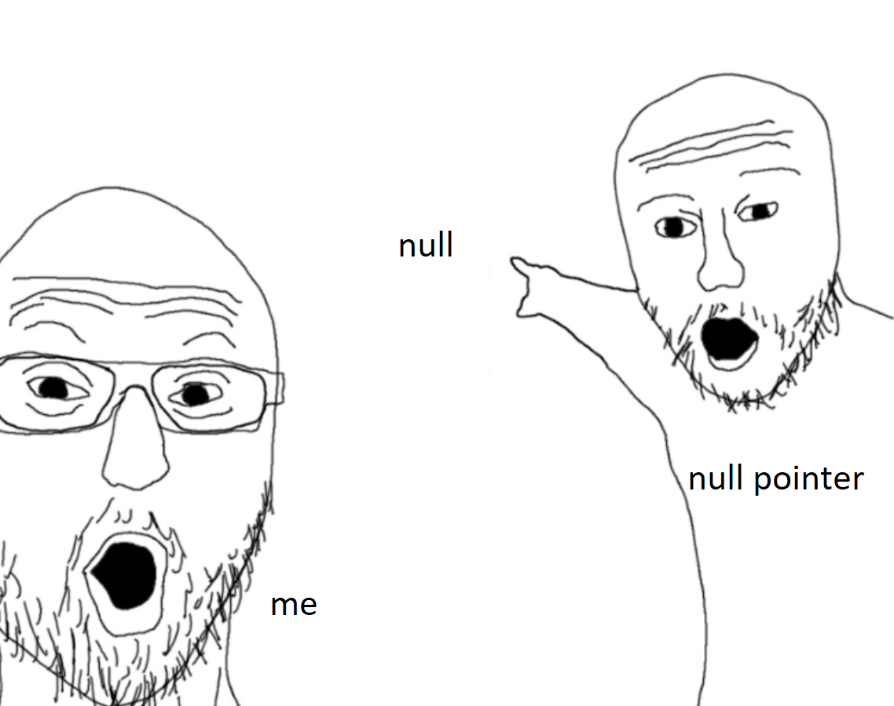

# Binary Clock

project for ap computer science (shocking)

### EPILEPSY WARNING IF YOU CHOOSE TO TURN ON RAVE MODE

JDK: azul zulu 19.0.1 (tested as far back as 11)

icon credit (because i was told to): 
<a href="https://www.flaticon.com/free-icons/hackathon" title="hackathon icons">Hackathon icons created by Flat Icons - Flaticon</a>

also includes preferences that save to a file, the directory is [user home folder]/.rdhbinaryclock (it's a hidden folder)

ye

